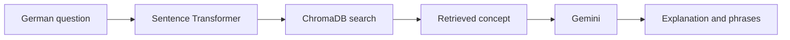

# Technical German RAG Assistant

A retrieval-augmented learning assistant that helps data professionals explain technical concepts in German using accurate, interview-ready vocabulary.

The application searches a curated German knowledge base, retrieves the most relevant concept, and uses Gemini to return a concise explanation and expressions worth learning.

## Problem

Knowing a technical concept and explaining it confidently in another language are different skills. Data professionals preparing for German-speaking interviews may understand machine learning or statistics but still struggle to use the expected terminology.

This project addresses that gap. Instead of asking an LLM to answer from general knowledge, it grounds each response in a curated German reference answer. It is designed for vocabulary practice, interview preparation, and technical discussions.

## Demo

Try it live: [vorstellungsgesprach.streamlit.app](https://vorstellungsgesprach.streamlit.app)

Example interaction:

```text
Question: Wie werden fehlende Werte mithilfe der nächsten Nachbarn ergänzt?

Answer: Fehlende Werte können mit einem KNN-Imputer anhand ähnlicher
Beobachtungen ergänzt werden.

Important expressions:
- die nächsten Nachbarn
- ähnliche Beobachtungen
- fehlende Werte ersetzen
- der Mittelwert der Nachbarn
```

The Streamlit interface also lets the user open the complete reference answer behind the generated response.

## How it works



1. The user submits a German question.
2. `paraphrase-multilingual-MiniLM-L12-v2` creates a normalized query vector.
3. ChromaDB retrieves the closest concept from the local knowledge base.
4. The query and reference concept are inserted into a structured prompt.
5. Gemini returns JSON containing a short introduction and important phrases.
6. Streamlit displays the result and the complete reference answer.

## Current results

### Retrieval evaluation

The evaluation set contains 54 German questions: three queries for each of the 18 concepts. Every query has an expected concept ID.

| Metric | Result |
|---|---:|
| Hit Rate@1 | 0.704 |
| Hit Rate@3 | 0.870 |

The expected concept is ranked first for 70.4% of the questions and appears among the first three results for 87.0%.

Only vector retrieval has been evaluated. These numbers are a baseline; they do not show that vector search is better than lexical or hybrid search.

```bash
uv run python scripts/evaluation_retrieval.py
```

Detailed results are saved under `outputs/`.

### LLM evaluation

The project supports multi-model evaluation for faithfulness, relevance, German language quality, phrase quality, request success, and errors.

Run one random query against the configured candidate models:

```bash
uv run python scripts/single_query.py
```

Run the larger comparison:

```bash
uv run python scripts/evaluate_models.py
```

The full comparison is not complete. Gemini free-tier limits returned `429 RESOURCE_EXHAUSTED` after a small number of successful requests. These failures measure API availability, not model quality, so incomplete model results must not be used for a fair ranking.

The application currently uses `models/gemini-flash-lite-latest`; `models/gemini-flash-latest` is configured as the evaluation judge. A definitive winner should only be selected after every candidate completes the same query set.

## Dataset

The custom dataset at `data/raw/topics.json` contains 18 curated concepts covering machine learning, preprocessing, statistics, evaluation, and survival analysis.

| Field | Purpose |
|---|---|
| `id` | Unique concept identifier |
| `question_de` | Reference question in German |
| `answer_de` | Complete German reference answer |
| `topic` | Concept name |
| `tags` | Categories and related terms |
| `phrases` | Expressions for vocabulary practice |

Topics include imbalanced data, confusion matrices, clustering, cross-validation, hazard ratios, relative risk, odds ratios, feature engineering, correlations, feature scaling, decision trees, KNN imputation, R², and F1 score.

## Quickstart

### Prerequisites

- Python 3.12
- `uv`
- Gemini API key

### 1. Clone and install

```bash
git clone <repository-url>
cd vorstellungsgesprach
uv sync
```

### 2. Configure Gemini

Create `.env` in the project root:

```env
GEMINI_API_KEY=your-api-key
```

The key is required for answer generation and LLM evaluation. Embeddings run locally.

### 3. Build the knowledge base

```bash
uv run python main.py pipeline
```

This loads and validates the dataset, creates searchable documents and normalized embeddings, and stores them in the persistent ChromaDB collection `concepts_de`.

### 4. Start the application

```bash
uv run streamlit run app.py
```

No separate database server is required.

## Run with Docker

The application can also be built and run in a container, without installing Python or `uv` locally.

```bash
docker compose up --build
```

The image installs dependencies with `uv`, builds the ChromaDB knowledge base during the build step, and starts the Streamlit app. Once it's running, open:

```
http://localhost:8501
```

If port `8501` is already in use on your machine, change the host port in `docker-compose.yml` (for example `"8502:8501"`).

A `GEMINI_API_KEY` must be available in a `.env` file in the project root; `docker-compose.yml` loads it automatically via `env_file`.

## Configuration

| Setting | Current value |
|---|---|
| Dataset | `data/raw/topics.json` |
| Vector database | `data/processed/chroma_db` |
| Collection | `concepts_de` |
| Embedding model | `paraphrase-multilingual-MiniLM-L12-v2` |
| Generation model | `models/gemini-flash-lite-latest` |
| Judge model | `models/gemini-flash-latest` |

## Project structure

```text
.
├── app.py                         # Streamlit interface
├── main.py                        # Ingestion entry point
├── data/
│   ├── raw/topics.json            # Curated knowledge base
│   └── processed/chroma_db/       # Generated vector index
├── scripts/
│   ├── evaluation_retrieval.py   # Retrieval evaluation runner
│   ├── evaluate_models.py        # Multi-model evaluation runner
│   └── single_query.py           # Random-query model check
├── src/
│   ├── build_documents.py        # Search-document construction
│   ├── embeddings.py             # Local embeddings
│   ├── evaluation.py             # Evaluation functions and reports
│   ├── evaluation_queries.py     # 54 labeled queries
│   ├── load_store_data.py        # Data and ChromaDB operations
│   ├── models.py                 # Gemini model discovery
│   ├── prompts.py                # Generation and judge prompts
│   └── rag.py                    # Retrieval and generation flow
├── outputs/                       # Evaluation reports
├── pyproject.toml                 # Dependencies
└── uv.lock                        # Locked versions
```

## Design decisions and trade-offs

- **Local multilingual embeddings:** avoid a paid embedding API and support German, but some related concepts remain difficult to separate.
- **ChromaDB:** makes the small knowledge base persistent and easy to run locally, but was not selected through a comparison with other stores.
- **Structured grounded answers:** predictable JSON emphasizes learning phrases, but an incorrect retrieved concept can still produce an irrelevant answer.
- **Flash Lite generation:** selected for concise output and low expected cost, although the quota-limited evaluation does not prove it is the best candidate.

## Troubleshooting

### `ModuleNotFoundError: No module named 'load_data'`

Run commands from the project root and import project modules through `src`, for example `from src.load_store_data import load_data`.

### `FileNotFoundError` for `topics.json`

Confirm that `data/raw/topics.json` exists and run commands from the repository root.

### ChromaDB collection not found

Create the index before starting the app:

```bash
uv run python main.py pipeline
```

### `429 RESOURCE_EXHAUSTED`

The Gemini quota has been reached. Wait for it to reset, reduce the models or queries, or use a plan with sufficient quota. Do not count these errors as poor answers.

## Testing and monitoring

The labeled retrieval and LLM evaluation scripts test application quality. A conventional automated unit-test suite is not currently documented.

### User feedback

Each answer in the Streamlit interface includes a feedback control (👍/👎 plus an optional comment). Feedback is persisted to a local SQLite database (`data/feedback.db`) via `src/feedback.py`, so it survives across sessions and container restarts (when the `data/` volume is mounted).

This feedback is intended for manual review: periodically inspecting `feedback.db` can surface concepts with confusing or incomplete reference answers, informing updates to `data/raw/topics.json` or to the generation prompt.

Note that on Streamlit Community Cloud the filesystem is ephemeral, so feedback collected there does not persist across redeploys. A future improvement is to move this table to an external database (for example Supabase or Turso) for durable storage in production.

A dedicated operational metrics dashboard is not implemented.

## Limitations

- The knowledge base contains only 18 manually curated concepts.
- Only vector retrieval has been evaluated.
- The full LLM evaluation is blocked by free-tier quotas.
- Out-of-scope questions may retrieve an unrelated nearest concept.
- No confidence threshold, hybrid search, reranking, or query rewriting is used.
- Feedback is stored locally and does not persist across Streamlit Cloud redeploys; a full monitoring dashboard and CI/CD are not implemented.

## Future work

1. Add a confidence threshold and an explicit “I do not know” response.
2. Compare vector, lexical, and hybrid retrieval on the same 54 queries.
3. Evaluate reranking and query rewriting.
4. Complete a balanced LLM comparison within available quotas.
5. Expand the dataset and evaluation set.
6. Add automated tests, persistent feedback, and monitoring.
7. Add Docker Compose and deployment.

## Rubric self-evaluation

This is an evidence-based self-assessment, not the final reviewer score.

| Criterion | Score | Evidence |
|---|---:|---|
| Problem description | 2/2 | User, problem, and grounded solution documented |
| Retrieval flow | 2/2 | ChromaDB and Gemini are both used |
| Retrieval evaluation | 1/2 | One approach evaluated with 54 labeled queries |
| LLM evaluation | 1/2 | Multiple models supported; full run quota-limited |
| Interface | 2/2 | Streamlit interface |
| Ingestion pipeline | 1/2 | Python ingestion pipeline |
| Monitoring | 1/2 | User feedback (rating + comment) collected and persisted for manual review |
| Containerization | 2/2 | Dockerfile and docker-compose provided |
| Reproducibility | 2/2 | Dataset, lock file, configuration, and commands provided |
| Hybrid search | 0/1 | Not implemented |
| Document reranking | 0/1 | Not implemented |
| Query rewriting | 0/1 | Not implemented |
| Cloud deployment | 2/2 | Deployed on Streamlit Community Cloud |

## License

This project is licensed under the MIT License — see the [LICENSE](LICENSE) file for details.